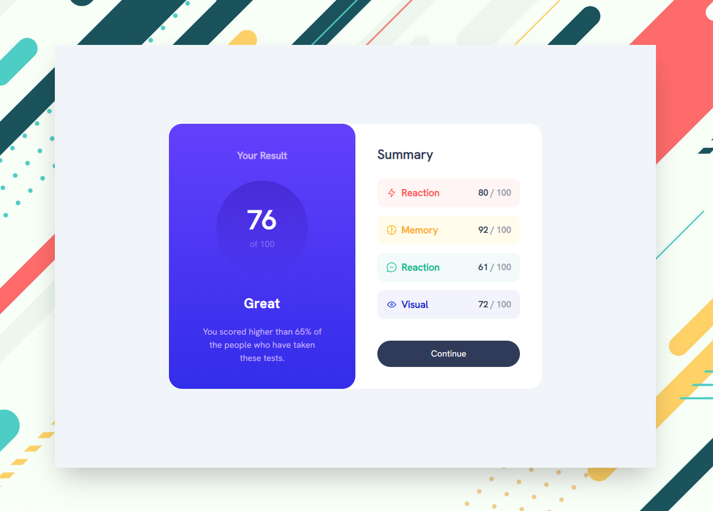
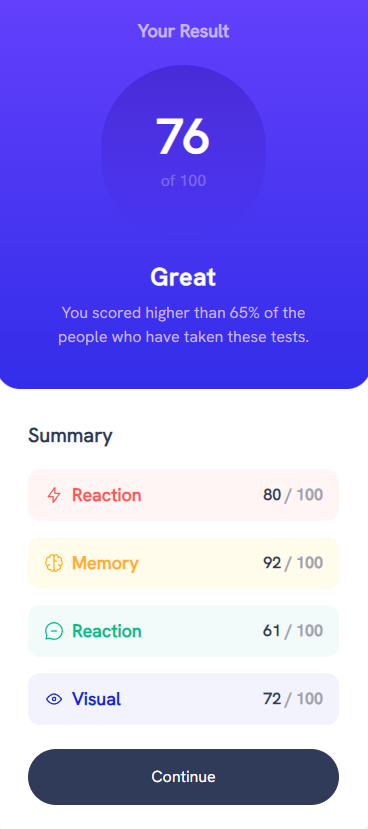

# Frontend Mentor - Results summary component solution

This is a solution to the [Results summary component challenge on Frontend Mentor](https://www.frontendmentor.io/challenges/results-summary-component-CE_K6s0maV).

## Table of contents

- [Frontend Mentor - Results summary component solution](#frontend-mentor---results-summary-component-solution)
  - [Table of contents](#table-of-contents)
  - [Overview](#overview)
    - [The challenge](#the-challenge)
  - [Screenshot](#screenshot)
    - [En escritorio 💻](#en-escritorio-)
    - [En movil 📱](#en-movil-)
    - [Links](#links)
  - [My process](#my-process)
    - [Built with](#built-with)
    - [What I learned](#what-i-learned)
    - [Author](#author)

## Overview

### The challenge

Users should be able to:

- View the optimal layout for the interface depending on their device's screen size
- See hover and focus states for all interactive elements on the page

## Screenshot

### En escritorio 💻

### En movil 📱

### Links

- Solution URL: [https://github.com/johnpablo7/results-summary-component](https://github.com/johnpablo7/results-summary-component)
- Live Site URL: [https://results-summary-component.johnpablo7.com/](https://results-summary-component.johnpablo7.com/)

## My process

### Built with

- Typescript
- Vite
- Tailwindcss
- Flexbox
- CSS Grid
- Mobile-first workflow
- React - JS library

### What I learned

Use this section to recap some of your main learnings, while working on this project I improved my skills in both Frontend and web design.

### Author

- Website - [https://johnpablo7.com](https://johnpablo7.com/)
- Frontend Mentor - [https://www.frontendmentor.io/profile/johnpablo7](https://www.frontendmentor.io/profile/johnpablo7)
- Twitter - [https://twitter.com/John_Pablo87](https://twitter.com/John_Pablo87)
